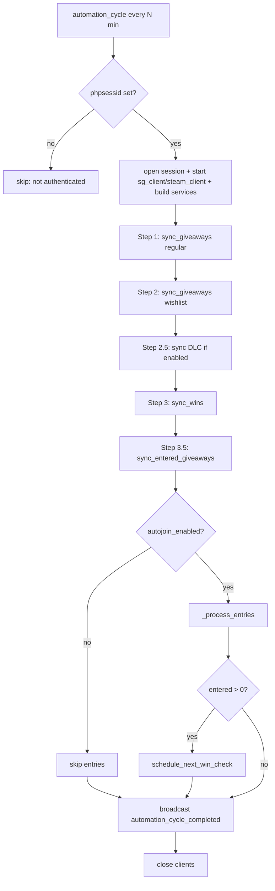

# Backend Architecture & Workflow

> Status: as-built description of `backend/src` (~16k LoC). The automation-layer
> redundancy called out in earlier revisions (§6) has now been consolidated —
> see §6 for the before/after and §7 for the resulting shape.
> Audience: maintainers. Last reviewed: 2026-06-17.

---

## 1. What the backend does

SteamSelfGifter is a single-user bot that logs into SteamGifts.com with a
session cookie (`PHPSESSID`), scrapes the giveaway listings, enriches each game
with data from the Steam store API, and automatically enters giveaways that
match the user's criteria — on a schedule, unattended. It also tracks wins,
detects unsafe ("trap") giveaways, and exposes everything over a REST + WebSocket
API consumed by the React frontend.

There is **no external concurrency model and no auth** by design: it runs as one
process on localhost (or in a single container), one user, one SQLite database.

---

## 2. Layered architecture

The code is a clean, conventional layered stack. Dependencies point downward
only.

```
            ┌─────────────────────────────────────────────┐
  HTTP/WS   │  api/         routers, schemas, deps, main    │
            ├─────────────────────────────────────────────┤
  logic     │  services/    giveaway, game, settings,       │
            │               notification, scheduler         │
            ├──────────────────────┬──────────────────────┤
  data      │  repositories/       │  utils/  (external)    │
            │  (SQLAlchemy)        │  steamgifts_client     │
            │                      │  steam_client          │
            ├──────────────────────┴──────────────────────┤
  models    │  models/      ORM entities                    │
            ├─────────────────────────────────────────────┤
  infra     │  core/ (config, events, logging, exceptions)  │
            │  db/   (session, migrations)                  │
            └─────────────────────────────────────────────┘

  workers/  ── background jobs that drive services on a schedule
              (APScheduler). Sit "beside" the API, share the services.
```

| Layer | Responsibility | Key files |
|-------|----------------|-----------|
| `api/` | HTTP/WebSocket surface, request validation, DI wiring | `main.py`, `routers/*`, `schemas/*`, `dependencies.py` |
| `services/` | Business logic; orchestrate repos + external clients | `giveaway_service.py`, `game_service.py`, `settings_service.py`, `notification_service.py`, `scheduler_service.py` |
| `repositories/` | Data access; one per entity over a `BaseRepository` | `base.py`, `giveaway.py`, `entry.py`, `game.py`, `activity_log.py`, `settings.py` |
| `utils/` | External I/O: SteamGifts scraping, Steam store API | `steamgifts_client.py`, `steam_client.py` |
| `models/` | SQLAlchemy 2.0 ORM models | `giveaway.py`, `game.py`, `entry.py`, `activity_log.py`, `settings.py`, `scheduler_state.py` |
| `workers/` | Scheduled background automation | `automation.py`, `processor.py`, `scanner.py`, `safety_checker.py`, `scheduler.py` |
| `core/` | Cross-cutting: config, event bus, logging, exceptions | `config.py`, `events.py`, `logging.py`, `exceptions.py` |
| `db/` | Async engine, session factory, migrations | `session.py`, `alembic/` |

### Data model

Six entities, two of them singletons (always `id=1`):

- **Giveaway** — a scraped giveaway: `code`, `game_name`, `price`, `end_time`,
  `is_entered`, `is_hidden`, `is_wishlist`, `is_won`, `is_safe`/`safety_score`,
  FK → Game.
- **Game** — Steam store metadata: `review_score`, `total_reviews`,
  `release_date`, `header_image`, `type`.
- **Entry** — a record that we entered a giveaway: `points_spent`, `entry_type`
  (`auto`/`manual`/`wishlist`), `status`.
- **ActivityLog** — append-only event/audit feed surfaced in the UI.
- **Settings** (singleton) — all user config incl. `phpsessid`.
- **SchedulerState** (singleton) — runtime counters: `total_scans`,
  `total_entries`, `total_errors`, `last_scan_at`, `next_scan_at`.

---

## 3. Two runtime entry points

The backend is driven from two directions that share the same service layer:

### a) Synchronous — the REST/WebSocket API

`api/main.py` builds the FastAPI app, mounts routers under `/api/v1/*`, and the
WebSocket under `/ws`. Per request, `dependencies.py` opens a DB session
(`get_db`), constructs the needed services (each with freshly-started HTTP
clients), and hands them to the router. Responses are ORM → Pydantic DTOs.

The event bus (`core/events.py::event_manager`) lets services/workers
`broadcast_event(...)`; the WebSocket router relays those to connected browsers
for live updates.

### b) Asynchronous — the scheduler

On startup (`lifespan` in `main.py`), if `automation_enabled`:

1. `scheduler_manager.start()` — a singleton wrapper around APScheduler's
   `AsyncIOScheduler` (`workers/scheduler.py`).
2. Register **`automation_cycle`** as an interval job every
   `scan_interval_minutes` (default 30).
3. Register **`safety_check_cycle`** every 45s (if `safety_check_enabled`).
4. **Win checks** are scheduled dynamically: after a cycle enters anything,
   `SchedulerService.schedule_next_win_check()` adds a one-shot date job timed
   to just after the soonest-expiring entered giveaway ends.

---

## 4. The core automation workflow

This is the heart of the system: one run of `workers/automation.py::automation_cycle()`.



**`sync_giveaways` (the scrape + cache step):**

```
steamgifts_client.get_giveaways(page)        # scrape HTML (BeautifulSoup)
  → for each giveaway:
      game_service.get_or_fetch_game(...)     # Steam store API enrichment
      giveaway_repo.upsert(...)               # cache in SQLite
```

**`_process_entries` (the entry step):**

```
get_eligible_giveaways(min_price, min_score, min_reviews, max_game_age, limit)
  → for each eligible giveaway:
      sleep(random 5–15s)                      # human-like pacing
      giveaway_service.enter_giveaway(code)    # refresh xsrf → POST → record Entry
      broadcast entry_success / entry_failed
```

**Safety check (separate background job, `safety_check_cycle`, every 45s):**

```
giveaway_repo.get_unchecked_eligible(limit=1) # is_safe IS NULL
  → check_giveaway_safety(code)               # scrape description, score it
  → if unsafe: hide_on_steamgifts(code)        # → is_hidden = True
```

The safety job and the entry job are **decoupled**: safety relies on hiding
unsafe giveaways so the entry step's `get_eligible` (which filters `is_hidden`)
skips them. See §6 for why this doesn't actually protect entries in practice.

---

## 5. Component reference

| Component | Role | Notes |
|-----------|------|-------|
| `SteamGiftsClient` | Scrapes giveaways/wins/entered pages; enters/hides giveaways; manages xsrf token & session | No retry/backoff/rate-limit; brittle CSS selectors |
| `SteamClient` | Steam store API for game metadata | Has rate limiter + retry/backoff |
| `GiveawayService` | Sync giveaways/wins/entered, eligibility, enter, safety check, hide | The largest service; the orchestration hub |
| `GameService` | Fetch/cache game metadata, compute review tiers | |
| `SettingsService` | Read/write the Settings singleton | |
| `NotificationService` | Write ActivityLog entries + broadcast events | |
| `SchedulerService` | Scheduler control (start/stop/pause), state/stats, **win-check scheduling** | |
| `SchedulerManager` | Singleton wrapper over APScheduler | Mirrors `is_running`/`is_paused` as its own state |
| `event_manager` | In-process pub/sub → WebSocket | |

---

## 6. Automation-layer consolidation (done)

The layering was always sound, but the automation layer had grown three
overlapping implementations of the same work plus a two-part safety design that
protected little. That redundancy has now been consolidated. Below is what
changed and why.

### 6.1 One "scan and enter" engine, shared by the manual triggers

Every job now bootstraps through `automation_context()` and the manual triggers
delegate to the same shared steps the scheduled cycle uses.

| Code path | How it's reached | State |
|-----------|------------------|-------|
| `workers/automation.py::automation_cycle` + `processor._process_entries` | scheduled job **and** `/run` | the single engine |
| `workers/processor.py::process_giveaways` | `/process` | thin wrapper → opens context, delegates to `_process_entries` |
| `workers/scanner.py::scan_giveaways` / `quick_scan` | `/scan`, `/scan/quick` | thin wrappers over `sync_giveaways` via the context |
| `workers/automation.py::sync_wins_only` | `/sync-wins` | thin wrapper over the context |
| `services/scheduler_service.py::run_automation_cycle` | — | **removed** (was dead and raised `TypeError`) |

The four manual triggers are all still exposed (the frontend calls `/run`,
`/scan`, `/process`, `/sync-wins`) — they're just thin wrappers now instead of
parallel re-implementations.

### 6.2 Client/service bootstrap lives in one factory

The previously copy-pasted block — "start `sg_client`, start `steam_client`,
build the services, `try/finally close`" — is now `workers/context.py`:

```python
async with automation_context() as ctx:   # yields session + ready services
    if not ctx.authenticated:              # no PHPSESSID → services are None
        return {"skipped": True, "reason": "not_authenticated"}
    await ctx.giveaway_service.sync_giveaways(...)
# clients + session closed automatically
```

When unauthenticated it yields a context with `authenticated=False` and no
clients started, so callers share one skip path.

### 6.3 Safety is now synchronous and inline

The background `safety_check_cycle` job is **deleted**. When
`settings.safety_check_enabled` is set, the entry loop calls
`enter_giveaway_with_safety_check` (check → hide if unsafe → enter) per giveaway,
so unsafe giveaways are never entered. This removes the racing 1-per-45s job and
its "assume safe on error" bug. Cost: one extra HTTP fetch per entry —
negligible against the existing 5–15s inter-entry sleep. Eligibility filtering
(`get_eligible`) already keyed on `is_hidden`/`is_entered`, not `is_safe`, so
dropping the background job changed no eligibility behavior; inline hiding keeps
unsafe giveaways out of future eligible lists.

### 6.4 `SchedulerService` is now cohesive

With `run_automation_cycle` gone it does exactly three related things: scheduler
control passthrough, state/stats persistence, and win-check scheduling.

### 6.5 One Alembic migration tree

The orphaned, stale `src/db/migrations/` tree is **deleted**; `src/alembic/` is
the only migration tree (`pyproject.toml` package list updated to match).

---

## 7. Resulting shape (engine)

```
workers/
  context.py     # automation_context(): the one bootstrap factory
  automation.py  # automation_cycle(): the only orchestrator (scheduled + /run)
                 # sync_wins_only(): thin /sync-wins wrapper
  processor.py   # _process_entries(): the only entry loop (inline safety)
                 # process_giveaways(): thin /process wrapper
                 # enter_single_giveaway(): thin /enter wrapper
  scanner.py     # scan_giveaways()/quick_scan(): thin /scan wrappers
  scheduler.py   # SchedulerManager (unchanged)
                 # safety_checker.py REMOVED — safety is inline at entry

services/
  scheduler_service.py   # control + state + win-check ONLY
```

Net effect: **one** automation path, **one** bootstrap, **one** safety mechanism
(synchronous), and the dead `TypeError` path plus the orphan migration tree
gone. No layer boundaries changed — this was consolidation within the
workers/scheduler area, not a rewrite.
